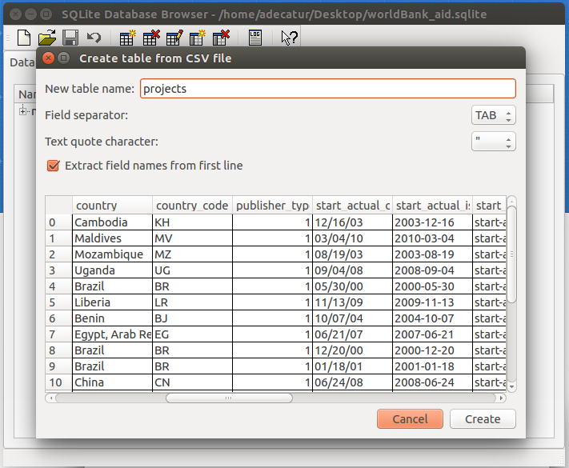
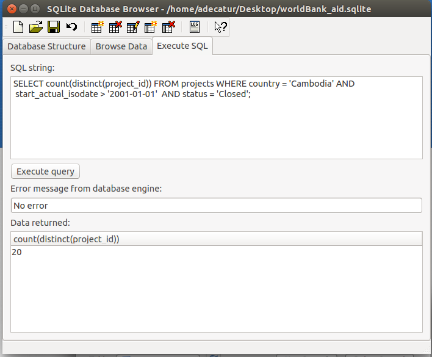

# SQL for Windows (and Mac!) Users
### a visual introduction

SQL is a query language for tables.
It's almost English.
It's like Excel but with SQL it's **easier** to do multi-step tasks, and SQL is much **better** at handling larger datasets.
You're about to learn it.

# the wordy part

The basic SQL workflow is:

1. get a [CSV](https://en.wikipedia.org/wiki/Comma-separated_values), TSV, or other [plain text](https://en.wikipedia.org/wiki/Plain_text) table
2. make an empty SQL database
3. import your table into the database
4. perform a query
5. export the output of your query

SQL is much more of course, but we won't go further than importing and joining three tables, and exporting a query about them.
You can do a **lot** with those skills.

Find an actual SQL tutorial [here](https://github.com/tthibo/SQL-Tutorial).
It's good.
Note for nerds: SQLite is a bit of a specialty flavor of SQL.  Kind of like chunky monkey.  Not for everybody, but it suites this exercise well because it has no configuration or permissions to deal with and is small.

## inputs

SQL is the easy part.
It can be hard to prepare your input tables before you even get them into your database.
All the cool kids make sure that their input tables meet the following conditions.
Luckily our inputs under the data folder do already!

  1. [machine readable](http://webarchive.okfn.org/okfn.org/201404/opendata/glossary/#machine-readable)
    1. start with plain text. A PDF is not a machine readable table!  HTML is not a machine readable table! XLS is not a machine readable table! 
      1. hint: save .xls and .xlsx as CSV
    1. the whole input file is just a single table
    1. the first line has the name of each column, and nothing else.
      1. this is called a header.  there is only one header line (no merge cells allowed!)
    1. each column has a name, and no name is repeated
    1. each column has internally consistent contents
      1. for example, don't put commas, periods, or '$' in columns that have amounts of money. It's for numbers!
    1. there is an ID column with unique identifiers for all of the rows in the table. Preferably it's the first column!
  1. no cases of [delimiter collision](https://en.wikipedia.org/wiki/Delimiter#Delimiter_collision)
    1. for example, if your input is CSV, then every time you see a comma it better mean there's a new column immediately to the right.
      1. it's OK to not follow this rule if your delimiters are properly escaped, for example the offending "cell" is surrounded by double quotes
  1. character encoded as [UTF-8](https://en.wikipedia.org/wiki/UTF-8)

See examples of what **not** to do [here](http://okfnlabs.org/bad-data/).

## let's do this thing 

1. Go to [sqlitebrowser.org](http://sqlitebrowser.org/) and download the right executable for your operating system. Should be .exe for Windows and .dmg for Mac.
1. install it!
1. open it!
1. now follow our screen shots.  we'll be using AidData's geocoded World Bank development aid research release.
  1. the original data can be found [here](http://aiddata.org/geocoded-datasets).
  1. find these three tables as tab separated values (TSV) under our data folder.
1. follow along with the pictures!  good luck and happy querying.


# the good stuff - pictures

open SQLite Database Browser


Make a new database - pick a location to save it in.  Use the extension ".sqlite".


New databases need at least one table. We're not ready to make one yet so we'll just fake it and get rid of this one later.


New tables need at least one column.  We'll fake this too.


You can see your useless new table in the Database Structure tab.


Let's import a table we actually care about!


You'll get interrupted when you try to import. Go ahead and save that useless table. It'll be gone soon but whatever.


OK, back to importing a table that __matters__. Go to this repo's folder and navigate to the data folder, or download the raw data from github directly.


Choose the projects.txt table to start. This is a plain text, machine readable table like we talked about earlier.


At first it will look like the table is broken.  That's because the default column delimiter is assumed to be commas.  Just change it to tabs.


That looks much better! Also, extract field names from the header.  That's the first line of the plain text table we're importing.


Just like it Excel, go ahead and drag out your columns to be wider and give them a look, or double click the column divider lines to do it automatically. Get a sense for your data!


Name this table "projects" after the input.



Delete that pesky starter table. Making it in the first place is not necessary when doing SQL at the command line, or in some other graphical systems. Just a quirk of this particular program.


Back in the Database Structure tab, expand your projects table to look at all the columns. We didn't specify data types (like TEXT, NUMERIC) but that's OK for now.


Go over to the Browse tab to get a look at the data in this table.


Now it's time to learn SQL **for real**.  You may have used it before without knowing, like in ArcGIS's "select by attributes."  SQL is easy!  The statement shown in the picture below just says "show me the first 10 project_id column values from the projects table that you find whose country is Cambodia."
Check out the output in the "Data returned" box below.
Here's the actual SQL, written in a more legible style:

```SQL
SELECT
	project_id
FROM
	projects
WHERE
	country = 'Cambodia'
LIMIT
	10
;
```
Notice that SQL is typically written with commands in capital letters to distinguish them from table names, column names, and values that come from the table that you might refer to.
A few tricky things here:

* the order of clauses matters
  * for example, the WHERE clause must come after the FROM clause
* values that come from your data are typically quoted, like 'Cambodia'
* you really do need a ';' at the end
  * software that lets you not put the ';' at the end just promotes bad habits. this is the programming equivalent of not brushing your teeth before bed.





```SQL
SELECT
	p.status,
	sum(t.transaction_value) as sum_commitments_USD_2011
FROM
	projects as p
	INNER JOIN transactions as t
	ON p.project_id = t.project_id
WHERE
	p.country = 'Cambodia'
	AND t.transaction_value_code = 'C'
GROUP BY
	p.status;

```

```SQL
SELECT
	p.status,
	sum(t.transaction_value) as sum_commitments_USD_2011
FROM
	projects as p
	INNER JOIN transactions as t
	ON p.project_id = t.project_id
WHERE
	p.country = 'Cambodia'
	AND t.transaction_value_code = 'C'
	AND p.sector_value LIKE '%health%'
GROUP BY
	p.status;
```

```SQL
SELECT
	p.project_id,
	p.country,
	p.project_title,
	t.transaction_isodate,
	t.transaction_value
FROM
	projects as p
	INNER JOIN transactions as t
	ON p.project_id = t.project_id
ORDER BY
	t.transaction_value DESC
LIMIT 10;
```

## tidbits

* what's another amazing way to easily join plain text tables and do so much more?
  * answer: [CSVKit](https://csvkit.readthedocs.org/en/0.9.0/)
